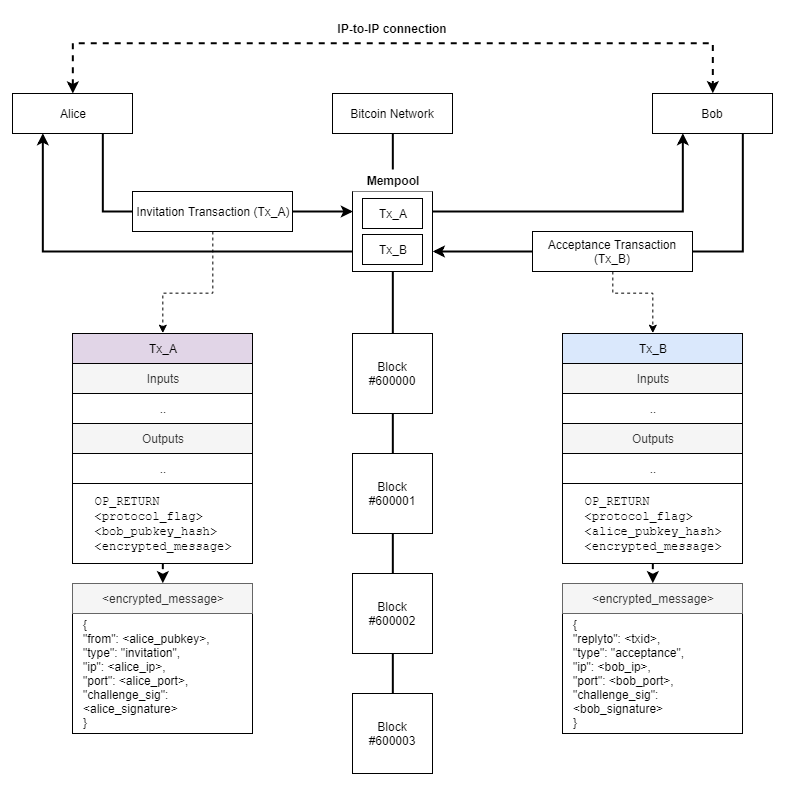

# ESTABLISHING IP TO IP COMMUNICATON CHANNELS ON A BLOCKCHAIN

## Abstract

This paper shows a method for establishing a secure communication channel between two peers who don't know each other's IP address/host, port or other dynamic identifier which are necessary to interconnect the devices, by exchanging the necessary information and authenticating on a blockchain by using their public keys as identifiers and certificates. This necessary information typically consist of IP addresses and port numbers, but use cases are not limited with this.

The one the main benefits of the method is that there is no need any intermediaries to establish a communication channel other than Bitcoin network itself which has a public ledger and is already incentivized to run in the long term.

The method may be useful for E2EE messaging, file transfers, SSH, Tor links, remote control etc., or even IP transactions which is discarded from Bitcoin in the early days and owners of misdirected payments in some cases.

## Motivation

There are many cases where peers can't interconnect their devices (e.g. for instant messaging) because of their IP addresses are dynamic and changing everytime they connect to the internet, but they still want to establish this somehow.

A common solution is, instead of to interconnect the devices, to introduce a trusted server that acts as a transmitter between the peers which is typically managed by a company/organization (e.g. WhatsApp, Signal) or a P2P network (e.g. BitMessage) which is typically relies on disincentivized nodes; or to use DHT servers (e.g. Tox).

Bitcoin is transparent, immutable, secured by miners and highly incentivized to run in the long term. Moreover it's a value system where peers can transfer value on and also has a big potential to be an integral part of the world in the near future.

With this in mind, it's a need to establish IP-based communications on Bitcoin where two peers don't know each other's connection details.

## Example

Let's suppose Alice and Bob want to establish a channel for instant messaging in a secure way, but they don't know each other's IP address to interconnect the devices because of that their addresses are changing every time they connect to the internet. According to the method, they can use a blockchain in such a case by following the steps below:

1) Alice and Bob exchange their public keys for once.

2) Alice adds Bob's public key to her wallet-messenger client.

3) Bob adds Alice's public key to his wallet-messenger client.

4) Alice prepares a transaction which contains an OP_RETURN output basically as following format:

```
OP_RETURN <protocol_flag> <bob_pubkey_hash> <encrypted_message>
```

5) `<encrypted_message>` is encrypted for `<bob_pubkey>`.

6) `<encyrpted_message>` consists of a JSON encoded string which contains Alice's public key, ip address, port and a challenge signature for proving the message is sent in *this* transaction and not replicated. 

```
{
    "from": <alice_pubkey>,
    "type”: "invitation”, 
    "ip”: <alice_ip>, 
    "port”: <alice_port>,
    "challenge_sig”: <signature_alice_pubkey( tx_inputs )>
}
```

*(See <u>Challenge Signatures</u> section for why it’s necessary an input related data should be in the challenge signature.)*

7) Bob’s client listens the blockchain and sees the message.

8) Bob decrypts the message with his private key, sees an invitation from `<alice_pubkey>` and checks the challenge signature.

9) Bob sends back a similar message in a transaction where `<encrypted_message>` contains his information: 

```
{
    "replyto": <txid>,
    "type”: "acceptance”,
    "ip”: <bob_ip>, 
    "port”: <bob_port>, 
    "challenge_sig”: "<signature_bob_pubkey( tx_inputs )>”
}
```

10) Alice’s client listens the blockchain and sees the acceptance message from Bob.

11) Now Alice and Bob knows each other's IP address and public key so they can try to connect each other whenever they want. But they might lie about their connection details. So another IP-based handshaking is needed to ensure this. They can use SSL/TLS, Double Ratchet Algorithm or other methods for the rest of the communication .

All the steps above can be completed in the fraction of a second by their clients thanks to that there is no need to wait broadcasted transactions to be mined in a block.

Once a secure connection channel between Alice and Bob is established, they can agree on using different public keys for the next time on-chain handshaking and all pf the instant messages can be encrypted with ephemeral keys considering forward secrecy.

## Challenge Signatures

Transactions to be broadcasted to the Bitcoin network carry encrypted messages which contains a field named `<challenge_sig>`. This field helps the receiver to check whether the message is *really* comes from the claiming public key and not replicated from somewhere else.

So `<challenge>` must be unique per transaction. This is because the `<encrypted_message>` can be copied from a past transaction and used in a new one by an attacker who actually doesn't have the public/private key, but the receiver of the message will think the signature is valid is such a case.

Therefore `<challenge>` and `<challenge_sig>` must be unique per transaction to ensure this. Easiest way to do this is to use a pre-defined part of the transaction (such as inputs) as `<challenge>`. So the receiver can check the `<challenge_sig>` to see whether it satisfies the `<challenge>` or not.

## Conclusions

We have outlined a method for bootstrapping an IP-to-IP communication channel where peers don't know each other's connection details, by broadcasting and listening transactions to Bitcoin network using their public keys as identifiers and certificates.

